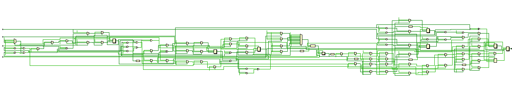
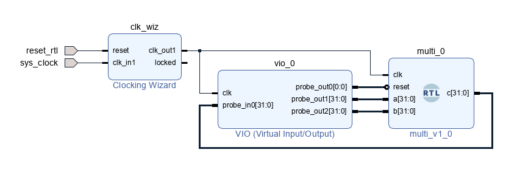

# Proyecto
Diseño de multiplicador de coma flotante de 32 bits. Se solicita hacer el testeo con workbench y VIO (virtual input/output de Xilinx).


# Entregable
- __multi_flotante.sv__: Contiene el desarrollo original. Nos basamos del libro x para partir dla maquina de estaoos
- __multi_flotante.v__: Es el mismo codiogo que _multi_flotante.sv_ pero en verilog. 
- __test_tb.v__: codigo verilog para testear el hardware _multi_flotante.v_.

Para el desarrollo del archivo _multi_flotante.v_ se seguio el libro _ISBN: 978-0-12-800056-4_ capitulo 4.6.

el problema fue que verilog solo permite hacer diseños con verilog y no con system verilog, asi que seguimos con el patron que dice el libro pero hacemos los siguientes cambios:

 de (system verilog)... | a (verilog)... 
| - | -
input logic | input
output logic | output
typedef enum logic [1:0] {<br/>S0,<br/> S1,<br/> S2} statetype; | parameter S0 = 2'b00;<br/>parameter S1 = 2'b01;<br/>parameter S2 = 2'b10;<br/>
statetype state, nextstate; | reg [1:0] state, nextstate;
always_ff@ | always@ 
always_comb | always@*


testeo: 

- verilog: lo puedes encontrar en el arbol del proyecto
- VIO: testeo real en hardware ([documentacion oficial](https://www.xilinx.com/products/intellectual-property/vio.html#Documentation)).


# Entorno
- __sistema operativo__: windows 10
- __tarjeta de desarrollo__: arty z7 10
- __IDE__: Vivado 2020.2
- __hardware description language__: verilog
# Links
## complemento 
- a uno [link](https://es.wikipedia.org/wiki/Complemento_a_uno)
- a dos [link](https://es.wikipedia.org/wiki/Complemento_a_dos)
## calculadora
- de numero centesimal a binario [link](https://www.rapidtables.org/convert/number/decimal-to-binary.html)
- binario a hexadecimal [link](https://cual-es-mi-ip.online/herramientas/conversores-numericos/conversor-binario-a-hexadecimal/)

## Arty z7-10
- manual de refencia de la placa [link](https://digilent.com/reference/programmable-logic/arty-z7/reference-manual)
- constraints [link](https://github.com/Digilent/digilent-xdc/blob/master/Arty-Z7-10-Master.xdc)
# Protocolo IEEE 754
aqui se encontrara refencia del protocolo:
- explicacion del protocolo en wikipedia [link](https://en.wikipedia.org/wiki/IEEE_754)
- sesgo de exponente [link](https://hmong.es/wiki/Exponent_bias)
## flotante decimal a binario
ejemplo de como se transforman numeros flotantes en decimal a binario:
- ejemplo 1 [link](https://www.youtube.com/watch?v=27JjUa-eu_E)
- convertir numero (como 1.75) a binario [link](https://www.youtube.com/watch?v=HcjXH9WGmAU)
## multiplicacion
paso a paso de como multiplicar dos numeros binarios en formato flotante haciendo uso del protoolo IEEE 754 
- ejemplo 1 [link](https://www.youtube.com/watch?v=RuKkePyo9zk)

implentacion de la multiplicacion binaria de dos numetos flotantes en verilog (hardware)
- en unos de los comentarios hay un ejemplo de un multiplicador flotante de doble presicion (64 bits) [link](https://www.quora.com/What-is-the-verilog-code-for-floating-point-multiplier)

# estructura del proyecto 
```
|-- hola (repositorio)
    |-- captura.PNG (imagen)
    |-- README.md (documentacion)
    |-- ultimo
        |-- ultimo.srcs
            |-- sim_1
                |-- new
                    |-- asd_tb.v (testeo)
            |-- sources_1
                |-- new
                    |-- multiplicador.v (hardware)
```
# Analisis
```
 3 3 2 2 2 2 2 2 2 2 2 2 1 1 1 1 1 1 1 1 1 1
 1 0 9 8 7 6 5 4 3 2 1 0 9 8 7 6 5 4 3 2 1 0 9 8 7 6 5 4 3 2 1 0
|-|- - - - - - - -|- - - - - - - - - - - - - - - - - - - - - - -|
```
## ejemplo 1
convertir 17.5 a binario
- primero convertir 17.5 a binario
```
dos a la | 7 6 5 4 3 2 1 0|-1-2-3-4-5
---------+----------------+----------
         | 1              |0 0 0
         | 2 6 3 1        |. . .
         | 8 4 2 6 8 4 2 1|5 2 1
         |                |  5 2
         |                |    5
---------+----------------+----------         
                 1 0 0 0 1.1   = 17.5
```
- luego se tiene que normalizar el 10001.1 de la siguiente manera

```
10001.1(binario) = 1.00011 x 2^4(binario)
```
- luego se tiene que sumar 127 al exponente y el resultado convertirlo a binario
```
4 + 127 = 131(decimal)

dos a la | 7 6 5 4 3 2 1 0|-1-2-3-4-5
---------+----------------+----------
         | 1              |0 0 0
         | 2 6 3 1        |. . .
         | 8 4 2 6 8 4 2 1|5 2 1
         |                |  5 2
         |                |    5
---------+----------------+----------         
           1 0 0 0 0 0 1 1     = 131
```
- luego se tiene que convertir el numero 
  - signo (0): por ser positivo
  - exponente (10000011): que es 131 convertido a binario
  - numero (00011000000000000000000): porque se le tiene que quitar el primer 1 y luego se completa con 0s a la derecha
  
- resultado:
```
signo  exponente                   numero
|-|- - - - - - - -|- - - - - - - - - - - - - - - - - - - - - - -|
 0 1 0 0 0 0 0 1 1 0 0 0 1 1 0 0 0 0 0 0 0 0 0 0 0 0 0 0 0 0 0 0
```

