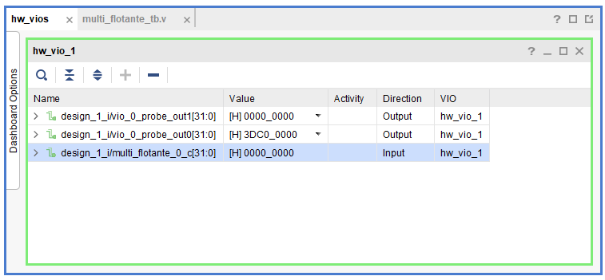

# Proyecto
Diseño de multiplicador de coma flotante de 32 bits. Se solicita hacer el testeo con workbench y VIO (virtual input/output de Xilinx).


# Entregable
- __multi_flotante.v__: Hardware en verilog. 
- __multi_flotante_tb.v__: codigo verilog para testear el hardware _multi_flotante.v_.
- testeo en workbench y VIO.

# Multiplicacion binaria: Protocolo IEEE 754
para entender el protocolo, comenzaremos por un ejemplo: 
- Se multplicaran dos numeros flotantes en base decimal 
- se transformaran a base binaria. 
- Finalmente se pondran en el formato definido por el estandar IEEE 754

multiplicamos los siguientes numeros:
```
A = -17.5 
B = 1.15625
C = resultado

-17.5 x 1.15625 =    -20.234375  (decimal)
```
los pasamos a binario:
```
dos a la | 7 6 5 4 3 2 1 0|-1-2-3-4-5
---------+----------------+----------
         | 1              |0 0 0 0 0 0
         | 2 6 3 1        |. . . . . .
         | 8 4 2 6 8 4 2 1|5 2 1 0 0 0
         |                |  5 2 6 3 1
         |                |    5 2 1 5
         |                |      5 2 6
         |                |        5 2
         |                |          5
---------+----------------+----------
               - 1 0 0 0 1.1           = -17.5
                         1.0 0 1 0 1   =   1.15625
               - 1 0 1 0 0.0 0 1 1 1 1 = -20.234375

-10001.1 x 1.00101 = -10100.001111  (binario)
```
normalizamos los numeros: 
```
-10001.1      = -1.00011      x 2^(4)
+    1.00101  = +1.00101      x 2^(0)
-10100.001111 = -1.0100001111 x 2^(4)
```
sesgamos potencias:
```
A_potencia: 127 + 4 = 131 = 10000011
B_potencia: 127 + 0 = 127 = 01111111
C_potencia: 127 + 4 = 131 = 10000011
```
Finalmente armamos las tramas:
```
+-+--------+-----------------------+        
|s| expone |        mantisa        |
+-+--------+-----------------------+
|3|32222222|2221111111111          |
|1|09876543|21098765432109876543210| pocision partiendo de 0 LMSB
+-+--------+-----------------------+        
|1|10000011|00011000000000000000000| primer numero
|0|01111111|00101000000000000000000| segundo numero
|1|10000011|01000011110000000000000| resultado
+-+--------+-----------------------+        
```      


referencias:
- explicacion del protocolo en wikipedia [link](https://en.wikipedia.org/wiki/IEEE_754)
- sesgo de exponente [link](https://hmong.es/wiki/Exponent_bias)
- flotante decimal a binario ejemplo 1 [link](https://www.youtube.com/watch?v=27JjUa-eu_E)
- flotante decimal a binario ejemplo 2 [link](https://www.youtube.com/watch?v=HcjXH9WGmAU)
- multiplicacion teoria ejemplo 1 [link](https://www.youtube.com/watch?v=RuKkePyo9zk)
- multiplicacion harware [link](https://www.quora.com/What-is-the-verilog-code-for-floating-point-multiplier)


# Diseño
Para este desarrollo se uso una maquina de estados Mealy. Me guie de la maquina de estados del libro __ISBN: 978-0-12-800056-4__, capitulo 4.6.


Para poder agregar el hardware al bloque de diseño, el HDL a utilizar debe ser verilog y no system verilog, que es el HDL que el libro usa.


Se consideraron las siguientes equivalencias entre system verilog y verilog para hacer funcionar el hardware:

 de (system verilog)... | a (verilog)... 
| - | -
input logic | input
output logic | output
typedef enum logic [1:0] {<br/>S0,<br/> S1,<br/> S2} statetype; | parameter S0 = 2'b00;<br/>parameter S1 = 2'b01;<br/>parameter S2 = 2'b10;<br/>
statetype state, nextstate; | reg [1:0] state, nextstate;
always_ff@ | always@ 
always_comb | always@*

Se diseño el conjunto de pasos de la maquina de estados: 

- S_inicial  
  - todos los registos a 0
- S_asignacion
  - se asigna los valores a,b a los registros segun corresponda 
  - antes de pasar la mantisa al registro, la mantisa tiena la siguiente forma 10100000 = 1.101
  - al pasar al registro toma la siguiente forma 10100000 con exponente 2^-8
  - una vez hecho esto con a y b estamos listos para hacer operaciones normales 
- S_cero 
  - si alguna mantisa es 0 se acaba la logica
- S_signos   
  - se genera el signo de c
- S_mantisa_a 
  - podriamos trabajar asi, pero se busca que la multiplicacion de registros mantisas no sea tan grande ( 10010000000 * 10100000000)
  - lo que hacemos es dividir el registro mantisa entre 2 y multiplicar el registro exponente por 2 hasta que no se tenga 0 a la derecha.
  - mantisa a la derecha 
- S_mantisa_b  
  - hacemos lo mismo aqui... 
- S_exponentes 
  - obtenemos exponente de c 
- S_multipli   
  - obtenemos mantisa de c 
- S_mantisa_c  
  - aqui ya nos olvidamos del registro, la idea es pasarlo al formato IEEE 754 
  - usamos esta ecuacion: [BUS] - [0 en la izquierda] = [numero normalizado] 
- S_mantisa_c_2 
- S_fin 
  - fin 


# Despliegue

## PROJECT MANAGER

- abrir __Vivado__, seleccionar la tarjeta __arty z7 10__ y crear un proyecto.
- copiar y pegar los archivos __multi_flotante.v__ y __multi_flotante_tb.v__. Ponerlos en las carpetas de hardware y testbench respectivamente.

## IP INTEGRATOR

- crear diseño
- mandar el hardware al diseño


- diseñar el siguiente esquema en el diseño creado


- crear wrapper

## SIMULATION
- dar click en __Run Simulation__ para iniciar el testeo del archivo __multi_flotante_tb.v__. Asegurarse que este se encuentra como top en la carpeta de test. Dar click en __Tcl Console__ para ver si el testbench funciono correctamente.


## RTL ANALYSIS
Dar click en __Schematic__ para tener un detalle del hardware completo.


## SYNTHESIS

- ejecutar __Run Synthesis__ dandole click. Luego dar click en __SYNTHESIS__. Dar click a __I/O Ports__.


- editar para que quede asi (nos guiamos de las siguientes fuentes oficiales [manual de refencia de la placa](https://digilent.com/reference/programmable-logic/arty-z7/reference-manual) y [constraints](https://github.com/Digilent/digilent-xdc/blob/master/Arty-Z7-10-Master.xdc)):


## IMPLEMENTATION

- dar click a __Run Implementation__.

## PROGRAM AND DEBUG

- dar click en __Generate Bitstream__, luego __Open Target__ y luego __Program Device__.
- abrir VIO


- agregar todas las entradas del VIO y testear ([documentacion oficial](https://www.xilinx.com/products/intellectual-property/vio.html#Documentation))


- ver test



# Entorno
- __sistema operativo__: windows 10
- __tarjeta de desarrollo__: arty z7 10
- __IDE__: Vivado 2020.2
- __hardware description language__: verilog

# estructura del proyecto 
```
|-- hola (repositorio)
    |-- fotos (imagenes)
    |-- Untitled.mdj (diagrama de maquina de estados)
    |-- README.md (documentacion)
    |-- ultimo
        |-- ultimo.srcs
            |-- sim_1
                |-- new
                    |-- multi_flotante_tb.v (testeo)
            |-- sources_1
                |-- new
                    |-- multi_flotante.v (hardware)
```

# Links
## complemento 
- a uno [link](https://es.wikipedia.org/wiki/Complemento_a_uno)
- a dos [link](https://es.wikipedia.org/wiki/Complemento_a_dos)
## calculadora
- de numero centesimal a binario [link](https://www.rapidtables.org/convert/number/decimal-to-binary.html)
- binario a hexadecimal [link](https://cual-es-mi-ip.online/herramientas/conversores-numericos/conversor-binario-a-hexadecimal/)
- hexadecimal a binario [link](https://cual-es-mi-ip.online/herramientas/conversores-numericos/conversor-hexadecimal-a-binario/)
- hexadecimal a decimal [link](https://cual-es-mi-ip.online/herramientas/conversores-numericos/conversor-hexadecimal-a-decimal/)
